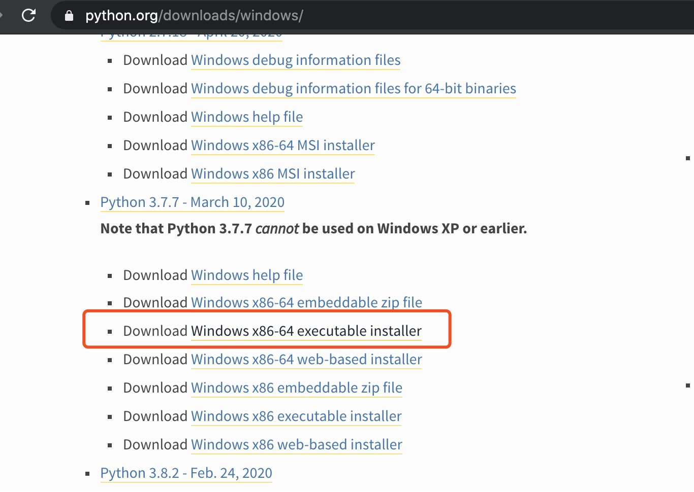
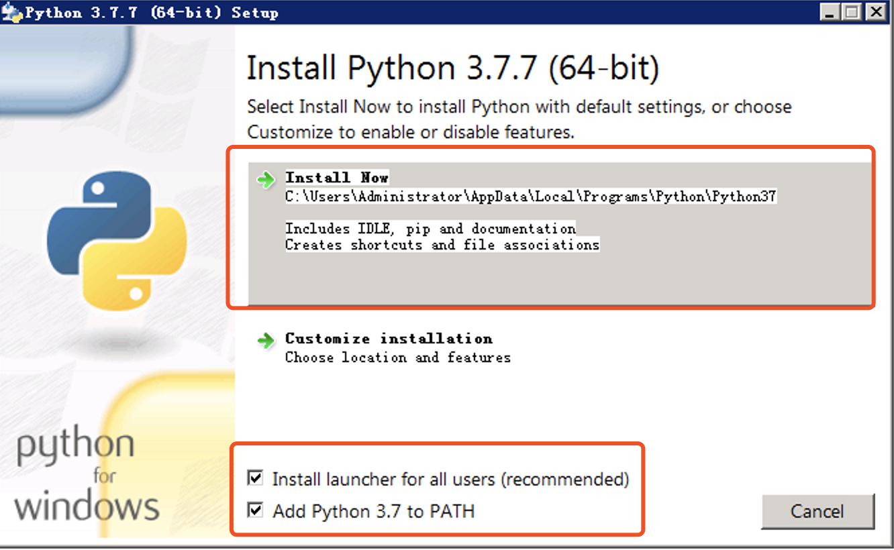
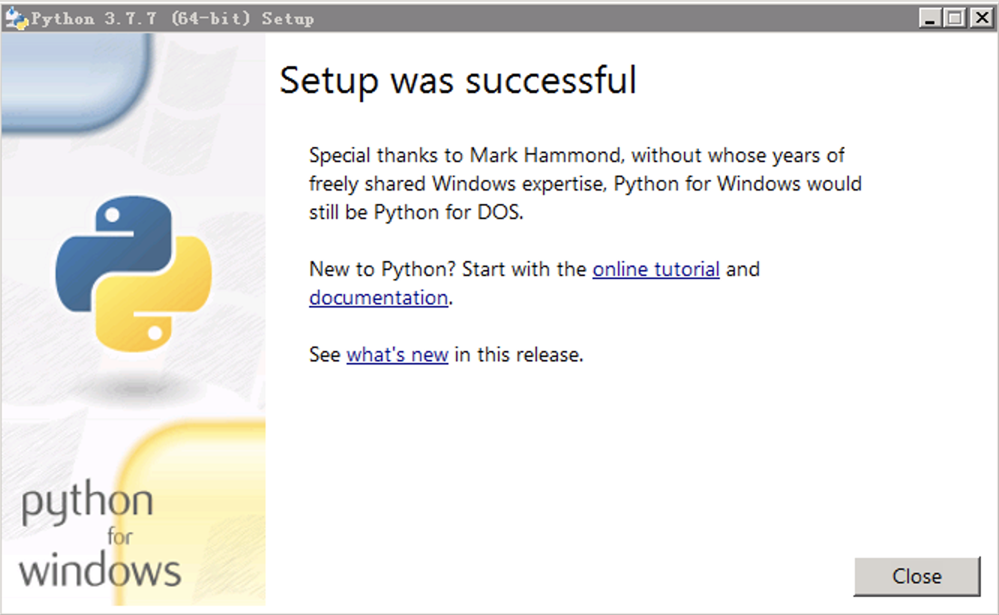
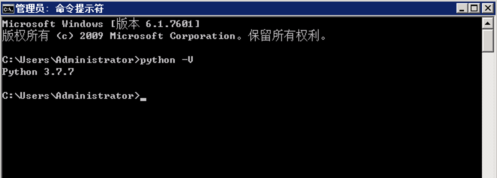

## 02.快速搭建Flask开发环境

### Python 环境搭建

1、Windows 下安装 Python 3.7.7 

安装包下载地址：[https://www.python.org/downloads/windows/](https://www.python.org/downloads/windows/)



推荐使用迅雷下载，因浏览器下载可能会很慢，下载连接为[https://www.python.org/ftp/python/3.7.7/python-3.7.7-amd64.exe](https://www.python.org/ftp/python/3.7.7/python-3.7.7-amd64.exe)

下载完成后，双击安装包【python-3.7.7-amd64.exe】，出现下面页面，注意两个红框部分，先将最下面红框部分勾选，然后点击第一个红框即进行安装。



等待安装完成，出现下面窗口，则表示安装成功。



验证一下是否安装成功，cmd 打开控制台，输入下面命令，回车后出现如图的字样 Python 3.7.7 ,表示成功安装并设置好了环境变量。

```python
python -V
```




### Flask 环境搭建


